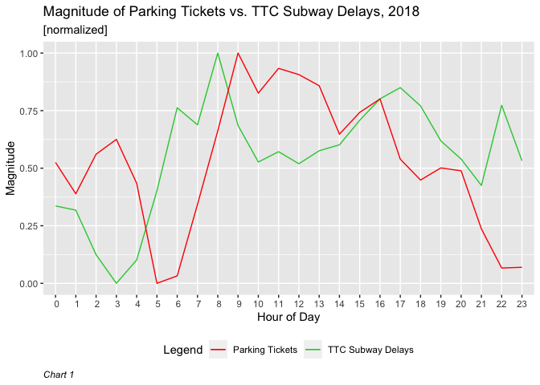

# An Exploration into Toronto Parking Tickets and TTC Subway Delays

[Paul Hodgetts](https://github.com/hodgettsp), [Thomas Rosenthal](https://github.com/mrpotatocode) & [Rutvik Bapat](https://github.com/rutvik-bapat)

January 21, 20202

### Abstract

*Explores the comparison in magnitude of Parking Tickets issued throughout Toronto and TTC Subway Delays across 24 hours for 2018. Data from TTC Subway Delays and Parking Tickets datasets from Open Toronto Data Portal were used. Both datasets were normalized to provide an accurate comparison. TTC Subway Delays and Parking Tickets were found to both peak at the beginning and end of the workday.*

### Outcome and Chart

<!-- -->

### Commentary

This report examines both the Toronto Parking Ticket and the TTC Subway
Delays (2018) datasets as a means of comparing the degree of magnitude
for both over 24 hours. Unfortunately, only 2018 data was available for
Toronto Parking Tickets, thus, this report is limited by the lack of
availability of the most recent data. As such, Chart 1 is not
necessarily indicative of the most recent trends. Additonally, Chart 1
explores the magnitude and not the frequency at which parking tickets
were issued or TTC subway delays occurred. This is because for proper
comparison of difference in the range at which parking tickets were
issued (range: 14501-118204, mean = 69100.67) and range at which TTC
delays occurred (range: 52-1525, mean = 864.04) required the data to be
normalized. As such, one can gather from Chart 1 when the most, or
fewest, parking tickets were issued or TTC delays occurred, but not the
amount of tickets issued or TTC delays that occurred. As well, time was
adjusted to only include the hour, such that a point on the x-axis
encompasses the whole hour. As such, Chart 1 provides a generalized look
at Toronto, and cannot be used to explore any one area or subway
station. Of note is that the issuance of parking tickets and subway
delays are both at their lowest and highest within an hour of each other
(5:00am and 3:00am, and 9:00am and 8:00am respectively). Additionally,
both have an increase toward the end of the workday with parking tickets
rising again at 4:00pm and TTC delays occurring at 5:00pm. It seems that
if one were to take the subway to avoid a parking ticket, or vice versa,
there would still be some impediment.

### References

R Core Team (2019). R: A language and environment for statistical
computing. R Foundation for Statistical Computing, Vienna, Austria. URL
<https://www.R-project.org/>.

H. Wickham. ggplot2: Elegant Graphics for Data Analysis. Springer-Verlag
New York, 2016.

Sharla Gelfand (2019). opendatatoronto: Access the City of Toronto Open
Data Portal. R package version 0.1.1.
<https://CRAN.R-project.org/package=opendatatoronto>

Hadley Wickham, Romain François, Lionel Henry and Kirill Müller (2019).
dplyr: A Grammar of Data Manipulation. R package version 0.8.1.
<https://CRAN.R-project.org/package=dply>

Hadley Wickham (2017). tidyverse: Easily Install and Load the
‘Tidyverse’. R package version 1.2.1.
<https://CRAN.R-project.org/package=tidyverse>

Hadley Wickham (2019). stringr: Simple, Consistent Wrappers for Common
String Operations. R package version 1.4.0.
<https://CRAN.R-project.org/package=stringr>

Open Data Dataset: TTC Subway Delay Data (2019). Retrieved from
<https://open.toronto.ca/dataset/ttc-subway-delay-data/>

Open Data Dataset: Parking Tickets (2018). Retrieved from
<https://open.toronto.ca/dataset/parking-tickets/>
